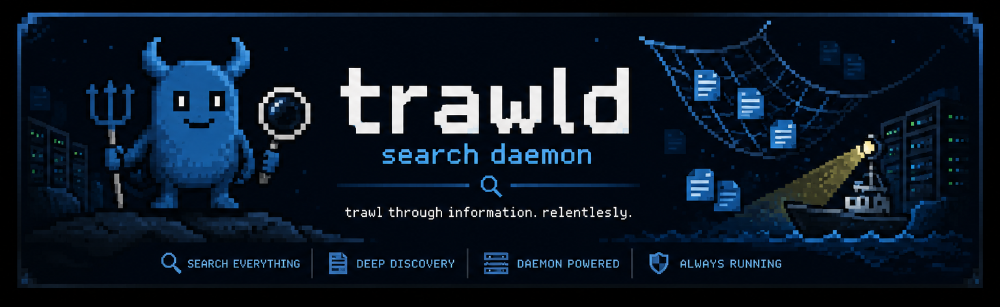
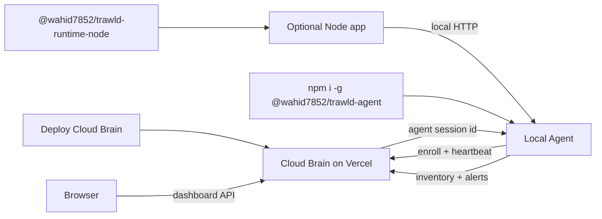

# trawld

Package vulnerability monitoring for developer fleets. trawld watches every enrolled machine, discovers projects automatically, and surfaces vulnerable dependencies in a real-time dashboard - no code changes to your apps required.

## How it works

1. Deploy the Cloud Brain once (Vercel + MongoDB).
2. Enroll machines by running `trawld setup`.
3. Open the dashboard - packages are indexed, vulnerabilities matched against the OSV database, and heartbeats keep online/offline status live.

## Components

- **[Cloud Brain](cloud/README.md)** - React dashboard + REST API, deploys to Vercel, persists to MongoDB.
- **[trawld Agent](agent/README.md)** - global npm package, setup wizard, passive project discovery, scheduled rescans, heartbeats.
- **[Runtime Node Hook](runtime-node/README.md)** - optional package for PID-aware process registration inside Node apps.

## Architecture



## Quick Start

### Deploy the Cloud Brain

1. Create a MongoDB database.
2. Deploy `cloud/` to Vercel.
3. Set environment variables:

```bash
MONGODB_URI=mongodb+srv://...
DATABASE_NAME=trawld
PUBLIC_CLOUD_URL=https://your-cloud.vercel.app
```

### Enroll a Machine

```bash
npm install -g @wahid7852/trawld-agent
trawld setup
```

The setup wizard connects to your Cloud Brain, picks project folders to watch, and optionally configures startup. Done - the machine appears in your dashboard.

## Open Enrollment

Any machine that can reach your Cloud Brain URL can enroll without a token. The agent sends machine metadata to `POST /api/agents/enroll` and gets back a session ID. All future inventory and heartbeat calls use that ID.

This keeps onboarding frictionless. If you need tighter access control later, add invite tokens or an IP allowlist at the reverse-proxy level.

## Local Development

```bash
# install all deps
npm install
cd cloud && npm install
cd ../agent && npm install
cd ../runtime-node && npm install

# start cloud + agent together
npm start
```

`start-all.js` starts the Cloud Brain and a local agent. The runtime hook is a package, not a service.

## Agent Behaviour

After setup the agent runs continuously:

- Startup scan of watched roots
- Manifest-change rescans (`package.json`, `requirements.txt`)
- Scheduled rescans every 5 minutes
- Heartbeats every 15 seconds (jittered)
- Snapshot hash deduplication - unchanged projects don't re-upload

## Repository Layout

```
cloud/          Dashboard + API (Vercel)
agent/          Global agent package
runtime-node/   Optional Node runtime hook
landing/        Static landing page (separate Vercel project)
start-all.js    Local dev launcher
```

## Publish Checklist

```bash
cd cloud && npm run build
cd ../agent && npm pack --dry-run
cd ../runtime-node && npm pack --dry-run
```

- Replace the hosted URL placeholder with your real Vercel URL
- `publishConfig.access` is `public` in both packages
- Production environment variables are set in Vercel
- Tested `trawld setup` against the hosted Cloud Brain

## License

MIT - built by [Wahid Khan](https://github.com/Wahid7852)
